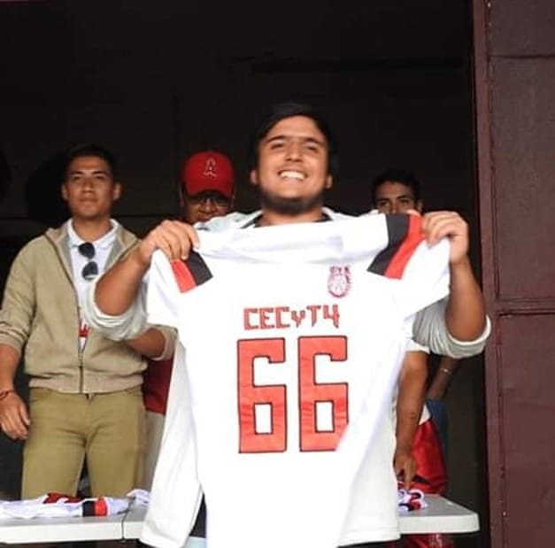

## Tobias Armando Gutierrez Salinas

### Correo: perepump@gmail.com




### Acordeón 

Cuando queremos crear un repositorio local y vincularlo al remoto utilizamos:

```git
$ > git init
$ > git add .
$ > git commit -m "descripcion del commit: primer commit"
$ > git remote add origin "URL del repositorio remoto"
$ > git push -u origin master/main 
**El ultimo depende de si elegimos cambiar la rama de master a main**
```

Cuando queremos subir cambios posteriores al mismo repositorio trabajando desde el mismo repositorio local

```git
$ > git add .
$ > git commit -m "Descripcion del commit"
$ > git push
```
Cuando clonamos un repositorio y subimos cambios

```git
$ > git branch -M master
$ > git remote add origin "URL del repositorio remoto"
$ > git push -u origin master
```

### Practica 4 Link

[Página desplegada en Netlify](https://earnest-kleicha-ecb313.netlify.app/posts/)

[Repositorio de la página](https://github.com/Tobias66Jags/tobias-astropage)

### Practica 5 Link

[Página desplegada en Vercel](https://tobias-astropage.vercel.app/)

## Lógica de negocio
[Diagrama football team](https://github.com/Tobias66Jags/gutierrez-tobias-practicas-3/blob/main/archivos-multimedia/Football-team-logic.drawio.png)

[Modelo Entidad-Relación](https://github.com/Tobias66Jags/gutierrez-tobias-practicas-3/blob/main/entidad-relacion-tobias.md)

[Esquema SQL](https://github.com/Tobias66Jags/gutierrez-tobias-practicas-3/blob/main/football_schema.SQL)

[CRUD SQL](https://github.com/Tobias66Jags/gutierrez-tobias-practicas-3/blob/main/football_crud.sql)


