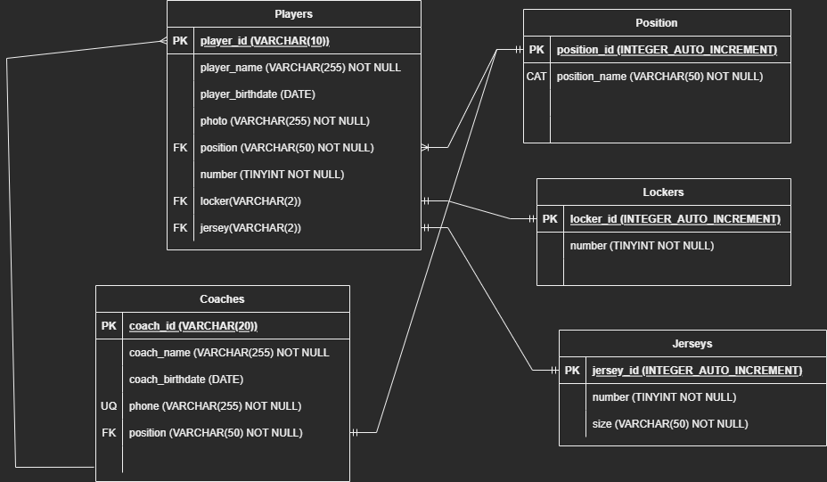

## Modelo Entidad-Relación en un equipo de fútbol americano juvenil

### Entidades:

1. Players
1. Coaches
1. Jerseys
1. Position (**CAT**)
1. Lockers

### Relaciones:

1. Los **Coaches** entrenan **Players** (_1 - M_).
1. Los **Players** usan **uniformes** (_1 - 1_).
1. Los **Players** tienen una **Posición** (_1 - M_).
1. Los **Players** usan **Casilleros** (_1 - 1_).
1. Los **Coaches** Usan **Casilleros** (_1 - 1_).

### Atributos:

#### Players

- Player_id (**PK**)
- Player_birthdate
- Player
- Photo
- Matricule(**UQ**)
- Number 
- Position_id (**FK**)
- Locker_id (**FK**)

#### Coaches
- coach_id (**PK**)
- coach_birthdate
- coach
- Phone (**UQ**)
- Position_id (**FK**)

#### Jerseys

- Jersey_id (**PK**)
- number 
- size

#### Lockers

- Locker_id (**PK**)
- number

#### Position

- position_id (**PK**)
- player_id (**FK**)
- coach_id (**FK**)

##### Valores de Posición
- Quarterback: Q
- Wide Receiver: WR
- Running back: RB
- Tight End: TE
- Center: C
- Offensive Guard: OG
- Offensive Tackles: OT
- Defensive End: DE
- Defensive Tackles: DT
- Linebacker: LB
- Cornerback: CB
- Fullback: FB
- Halfback: HB
- Free Safety: FS
- Strong Safety: SS
- Kiker: K
- Punter: P

### **Modelo Relacional**:

### **Reglas de Negocio**:

### Players

1. Crear _player_.
1. Leer todos los _players_.
1. Actualizar datos del _player_.
1. Eliminar _player_.

### Coaches

1. Crear _coach_.
1. Leer todos los _coach_.
1. Actualizar datos del _coach_.
1. Eliminar _coach_.

### Jerseys

1. Crear _jersey_.
1. Leer todos los _jerseys_.
1. Actualizar talla del _jersey_.

### Lockers

1. Crear _locker_.
1. Leer todos los  _lockers_.
1. Eliminar _locker_ . 

### Position

1. Crear _position_ de un _player_.
1. Actualizar _position_ de un _player_.
1. Leer las _positions_.

